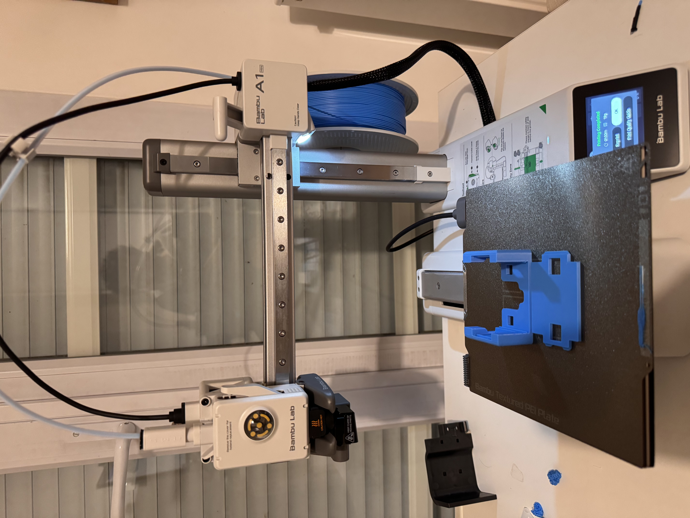
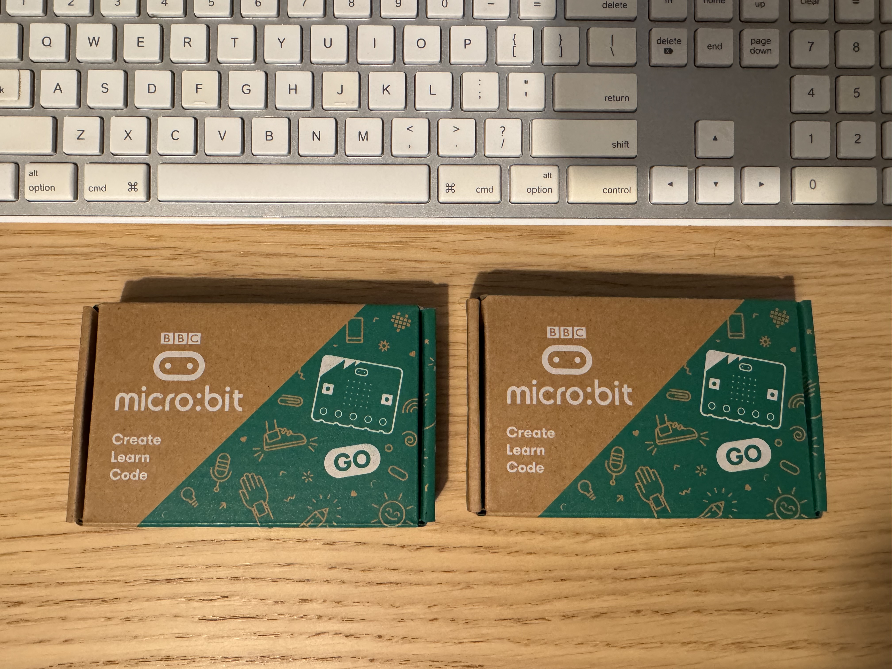
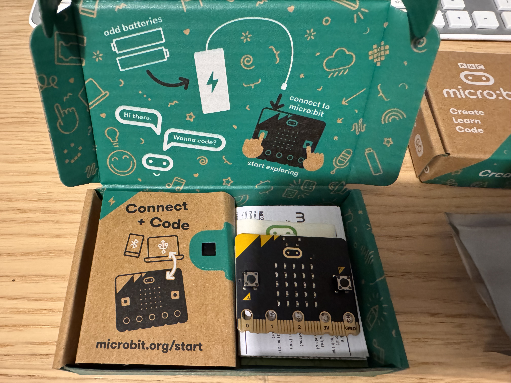

# 🤖 micro:bit STEM Day — Détails supplémentaires

A fun, hands-on robotics and STEM day organized by parents for their children — to spark curiosity and encourage learning through building, coding, creativity, and exploration. This first edition is a small pilot.

---

## Materials & Equipment

| Item | Quantity |
|------|----------|
| micro:bit v2 + extension kit with sensors | 1 |
| micro:bit v2 | 5 |
| Bambu Lab A1 Mini (3D printer demo) | 1 |
| Laptops | 1 per child (confirm count — may need extras) |

**micro:bits available:** 6 confirmed — need to confirm if enough for all children.

---

## Program

### 9:30 — Welcome, croissants, and introductions
- Arrival and settling in
- Croissants and drinks
- Short introductions and icebreaker

### 10:00 — Intro to programming and robotics *(JF, Olga)*
- What is coding?
- What is a robot?
- What is a micro:bit and what can it do? *(devices handed out)*
- Buttons, LED display, movement sensing, and radio communication

### 10:30 — Intro to 3D printing and micro:bit case *(Jad)*
- What a 3D printer is and how it works
- Examples of printed objects
- Presentation of the micro:bit case
- Live demo if possible (Bambu A1 Mini)

### 11:00 — micro:bit beginner projects *(All)*
Children follow simple guided examples, with room for advanced participants to personalize or extend.

Examples:
- Beating heart
- Animated animals
- Name badge
- Simple LED animations or mini-games

Resource: [microbit.org/projects/make-it-code-it](https://microbit.org/projects/make-it-code-it/){target="_blank"}

### 11:30 — Intro to Morse code & radio communication *(Hillary)*
- YouTube video introduction to Morse code
- Distribute the Morse reference cards
- What is Morse code? How dots and dashes form letters
- Simple decoding exercises — decode a message projected on the screen
- How micro:bits can send Morse-like signals over radio

### 12:15 — Lunch at Luigia 🍕

### 14:00 — Build a micro:bit v2 radio Morse messaging system

Each child builds a **simple micro:bit radio-based Morse transceiver**. The same program runs on every micro:bit — everyone can send and receive. The instructor's micro:bit can be taken to another room to send messages that children decode.

**Main activity:**
- The instructor micro:bit acts as the sender (can be in another room)
- The children's micro:bits act as receivers
- All devices use the same radio group
- Button A = dot, Button B = dash, A+B = end of letter, Shake = end of word
- Children decode dots/dashes manually using the printed Morse card

**For beginners:** receive and display dots and dashes, then decode the message manually with the Morse card.

**For non-beginners:** try to decode the whole letter or word without looking at the card.

**Extra for advanced children:** try the advanced [[receiver-guide|Receiver]] and [[sender-guide|Sender]] programs with automatic letter decoding.

#### Build guides

| Guide | Language |
|-------|----------|
| [[simple-morse-guide\|Simple Morse Guide]] | English |
| [[simple-morse-guide-fr\|Guide Morse Simple]] | Français |

#### Advanced guides (optional)

| Guide | Language |
|-------|----------|
| [[receiver-guide\|Receiver Guide]] | English |
| [[sender-guide\|Sender Guide]] | English |
| [[receiver-guide-fr\|Guide du Récepteur]] | Français |
| [[sender-guide-fr\|Guide de l'Émetteur]] | Français |
| [[kids-guide\|Kids Overview Guide]] | English |
| [[kids-guide-fr\|Guide des Enfants]] | Français |

**Groups:** split into small groups, each on their own radio channel — no crosstalk.

**Printed reference card** on every table — Morse alphabet for encoding and decoding.

**Message length guide:**
| Round | Length | Example |
|-------|--------|---------|
| Warm-up | 1 letter | `H`, `I`, `E` (short morse) |
| Main | 3 letters | `SOS`, `YES`, `NO` |
| Stretch | Short word | `HELLO`, `MORSE` |

---

### 14:45 — Morse challenge game

#### Option A — Morse Hangman *(warm-up, quick to explain)*
Sender transmits letters one at a time. Receivers decode and write them down. First team to shout the correct full word wins the round.

#### Option B — Treasure Hunt *(main game, most memorable)*
Morse messages from the sender (in another room) reveal clues hidden around the venue. Teams decode each message, find the object or location, and race to complete the chain.
- Requires: clues prepared in advance, enough space to hide them

#### Option C — Fastest Decoder *(energy round)*
Instructor sends the same 3-letter word to all groups simultaneously. First group to correctly ACK and shout the decoded word wins.

#### Option D — Morse Quiz
Instructor sends answers to simple questions (colours, animals, numbers). Teams decode and write answers. Relaxed pace — good right after lunch if energy is low.

> [!note] Recommended flow
> Hangman as warm-up → Treasure Hunt as main event (if space allows) → Fastest Decoder as a final energy round.

---

## Media

*Chronological order — the evening the programs were built and tested.*

| Time | File | Description |
|------|------|-------------|
| 21:49 |  | Bambu A1 Mini starting the case print |
| 21:52 |  | Two micro:bit v2 GO boxes |
| 22:00 |  | Unboxed — board and USB cable |
| 22:13 |  | Finished 3D printed micro:bit case |

---

## 🎓 Presentations

Slides used during the day (click to download):

| Presentation | Language |
|-------------|----------|
| [🖥️ Journée Code et Robots](microbit-stem-day/Journee_Code_et_Robots_v2.pptx) | 🇫🇷 Français |
| [📡 Code Morse et Communication](microbit-stem-day/Code_Morse_et_Communication.pptx) | 🇫🇷 Français |
